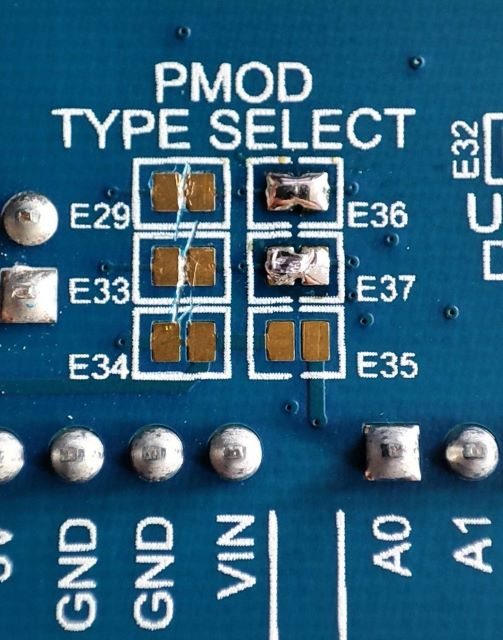

# PMOD Sensor Evaluation kit AMS Osram
https://zalmotek.com/products/PMOD-AMS-OSRAM-Sensor-EK/

### Hardware description
#### Overview

The evaluation kit contains the following sensors from AMS-Osram: TMF8828 (a direct time-of-flight (dToF) sensor), AS 7331 (a low-power, low noise integrated UV sensor), AS 7343 (a 14-channel highly versatile, multi-purpose spectral sensor) on a single PMOD enabled board that is compatible with the Renesas QC-IoT System and QC-Studio.

### Hardware Components used

#### TMF8828

The TMF8828 is a direct time-of-flight (dToF) sensor in a single modular package with associated VCSEL. The dToF device is based on SPAD, TDC and histogram technology and achieves 5000 mm detection range. Due to its lens on the SPAD, it supports 3x3, 4x4, 3x6 and 8x8 multizone output data and a wide, dynamically adjustable, field of view. A multi-lens-array (MLA) inside the package above the VCSEL widens up the FoI (field of illumination). All processing of the raw data is performed on-chip and the TMF8828 provides distance information together with confidence values on its I2C interface.
Datasheet can be found [here](https://ams-osram.com/products/sensors/distance-proximity-sensors/ams-tmf8828-configurable-8x8-multi-zone-time-of-flight-sensor#Datasheets).

#### AS7343

The AS7343 is a 14-channel highly versatile, multi-purpose spectral sensor enabling new consumer, commercial, industrial and laboratory applications. It is optimized for reflective, transmissive and emissive measurements including color matching, fluid or reagent analysis or general spectral reconstruction.
The spectral response is defined by individual channels covering approximately 380 nm to 1000 nm with 12+2 channels: 12 in the visible spectrum (VIS) to near-infrared (NIR) range, a clear channel and flicker channel. Applications can be assisted by full spectral reconstruction of light and an integrated flicker detection channel that can automatically flag ambient light flicker at 50/60 Hz as well as buffer data for externally calculating other flicker frequencies.

AS7343 integrates high-precision optical filters onto standard CMOS silicon via deposited interference filter technology. A built-in aperture controls the light entering the sensor array to increase accuracy. A programmable digital GPIO and LED driver enable light source and trigger/sync control. Device control and spectral data access is implemented through a serial I²C interface. The device is available in an ultra-low profile package with dimensions of 3.1 mm x 2 mm x 1 mm.

Datasheet can be found [here](https://ams-osram.com/products/sensors/ambient-light-color-spectral-sensors/ams-as7343-spectral-sensor#Datasheets).

#### AS7331

The AS7331 is a low-power, low noise integrated UV sensor. The three separated UVA, UVB and UVC channels convert optical radiation signals via UV optimized photodiodes to a digital result and realize a continuous or triggered measurement. The irradiance responsivity can be adjusted via Gain, conversion time and internal clock frequency to effect sensitivity, full scale range and LSB. The AS7331 offers a range of 12 Gain steps by a factor of two for each step. The conversion time is internally controlled over a wide range of 15 steps by a factor of two for each step. With the input pin (SYN), the conversion time can be externally controlled to adapt the measurement to the given environment and time base.

With its irradiance responsiveness factor and conversion time, the AS7331 supports an overall huge dynamic range up to 3.43E+10 (resolution multiplied by gain range). It achieves an accuracy of up to 24-bit signal resolution (internal via I²C and shifter 16-bit), with an irradiance responsivity per count down to 2.38 nW/cm² at 64 ms integration time. Via an integrated divider, the 16-bit I²C output can be adjusted to the significant bits of interest.

Datasheet can be found [here](https://ams-osram.com/products/sensors/ambient-light-color-spectral-sensors/ams-as7331-spectral-uv-sensor#Datasheets).

### Firmware description

**FSP version: 4.5.0**

The repository contains the following firmware samples: 

[*EKRA2E1_AS7331_SCI_IIC*](firmware_samples/EKRA2E1_AS7331_SCI_IIC.zip)

This sample was configured for the EK-RA2E1 Evaluation Kit and it reads and outputs data from the AS7331 UV A/B/C light sensor. The following output example shows how the firmware reads the raw UV values collected by the sensor and scales them. Additionally, the firmware reads the temperature values from the on-board temperature sensor and outputs them via SEGGER’s RTT.

[*EKRA2E1_AS7343_SCI_IIC*](firmware_samples/EKRA2E1_AS7343_SCI_IIC.zip)

This sample was configured for the EK-RA2E1 Evaluation Kit. It uses the AS7343 14-channel spectral sensor to measure the intensity of particular wavelengths of light and outputs them via RTT.

[*EKRA2E1_TMF8828_SCI_IIC*](firmware_samples/EKRA2E1_TMF8828_SCI_IIC.zip)

This sample was configured for the EK-RA2E1 Evaluation Kit, and it was initially designed to be a command line interpreter which enabled you to test different functionalities of the TMF8828 configurable 8x8 multi-zone Time-of-Flight Sensor without any change to the firmware itself.  For the purpose of keeping this sample simple and to the point, the firmware is given the measure command by default.

The sensor reading looks like this:

`#Obj,i2c_slave_address,result_number,temperature,number_valid_results,device_ticks,distance0_in_mm,confidence0,distance1_in_mm,confidence1,distance2_in_mm,confidence2, ...`

[*EKRA6M4_AS7331_IIC*](firmware_samples/EKRA6M4_AS7331_IIC.zip)

This sample was configured for the EK-RA6M4 Evaluation Kit and it reads and outputs data from the AS7331 UV A/B/C light sensor. The following output example shows how the firmware reads the raw UV values collected by the sensor and scales them. Additionally, the firmware reads the temperature values from the on-board temperature sensor and outputs them via SEGGER’s RTT.

[*EKRA6M4_AS7343_IIC*](firmware_samples/EKRA6M4_AS7343_IIC.zip)

This sample was configured for the EK-RA6M4 Evaluation Kit. It uses the AS7343 14-channel spectral sensor to measure the intensity of particular wavelengths of light and outputs them via RTT.

[*EKRA6M4_TMF8828_IIC*](firmware_samples/EKRA6M4_TMF8828_IIC.zip)

This sample was configured for the EK-RA6M4 Evaluation Kit, it was initially designed to be a command line interpreter which enabled you to test different functionalities of the TMF8828 configurable 8x8 multi-zone Time-of-Flight Sensor without any change to the firmware itself. For the purpose of keeping this sample simple and to the point, the firmware is given the measure command by default.

The sensor reading looks like this:

`#Obj,i2c_slave_address,result_number,temperature,number_valid_results,device_ticks,distance0_in_mm,confidence0,distance1_in_mm,confidence1,distance2_in_mm,confidence2, ...`

#  Quick-Start Guide

## Configuring Pmod1 to support Pmod Type 6A (I2C)

Before we begin setting up anything on the software side of things we need to enable I2C support on the Pmod interface. On both the EK-RA2E1 and the EK-RA6M4 Evaluation Kits only the Pmod1 interface can be configured to support I2C connections.

According to the EK-RA2E1 [user’s manual](https://www.renesas.com/us/en/document/man/ek-ra2e1-v1-users-manual), more specifically Table 13 found on page 19, we need to short the E18 and E19 jumpers and open the  E14 and E15 jumpers found on the back of the board.

Following the EK-RA6M4 [user’s manual](https://www.renesas.com/us/en/document/mat/ek-ra6m4-v1-users-manual), table 13 found on page 17, we need to short the E36 and E37 jumpers  and open the E29 and E33 jumpers found on the back of the board.

## Setting up e2 studio IDE

Download and install the latest version of [e2 studio IDE](https://www.renesas.com/us/en/software-tool/e-studio), making sure to install FSP4.6.0 and FSP4.5.0, support for the RA an RZ family and the GNU Arm Embedded 12.2.1 toolchain.

### EK-RA2E1

#### Creating the project
To create a new project go to **File -> New -> Renesas C/C++ Project -> Renesas RA**. Select the** Renesas RA C/C++ Project** template. After giving the project a fitting name you’ll be prompted to select the FSP Version, Board, Language, Toolchain and the Debugger. For the FSP Version select the latest one available (at the time of writing it’s **4.5.0**), the board needs to be EK-RA2E1, for the language check **C++**, the toolchain should be the latest available (at the time of writing it’s **GNU Arm Embedded 12.2.1** ) and for the Debugger select J-Link ARM. For this sample you can leave the default values of **Executable and No RTOS**. On the next screen select **Bare Metal - Minimal** and click **Finish**.

#### Configuring the stacks 

For this board we need to include the r_sci_i2c stack as it is the only one that works with I2C channel 2, the channel that gets routed to the Pmod interface. We now need to head out to the properties tab and select the appropriate channel 2 and the corresponding slave address. Make sure to select Fast-mode rate and fill in the Callback with i2c_master_callback.

One of the samples also needs the r_agt Low-Power Timer stack in order for it to work. We also need to configure it by changing the Mode to Periodic, channel to 0, Period Unit to 0xFFFF and Count Source to LOCO.

### EK-RA2E1

#### Creating the project

To create a new project go to File -> New -> Renesas C/C++ Project -> Renesas RA. Select the Renesas RA C/C++ Project template. After giving the project a fitting name you’ll be prompted to select the FSP Version, Board, Language, Toolchain and the Debugger. For the FSP Version select the latest one available (at the time of writing it’s 4.6), the board needs to be EK-RA6M4, for the language check C++, the toolchain should be the latest available (at the time of writing it’s GNU Arm Embedded 12.2.1) and for the Debugger select J-Link ARM. For this sample you can leave the default values of Executable and No RTOS. On the next screen select Bare Metal - Minimal and click Finish.

#### Configuring the stacks

For this board we need to include the r_iic_master stack as it is the only one that works with I2C channel 1, the channel that gets routed to the Pmod interface. We now need to head out to the properties tab and select the appropriate channel 1 and the corresponding slave address. Make sure to select Fast-mode rate and fill in the Callback with i2c_master_callback.

One of the samples also needs the r_agt Low-Power Timer stack in order for it to work. We also need to configure it by changing the Mode to Periodic, channel to 0, Period Unit to 0xFFFF and Count Source to LOCO.

## Header files description

### The i2c_op.h header file

In this header file we have defined some basic functions needed for I2C operations as follows:

The *delay* function takes one integer as an argument and delays the system for the given number of milliseconds.

The *i2c_master_callback* function is the same function we’ve referenced when configuring the I2C stacks. This function updates the i2c_event variable after every I2C operation concludes.

The *validate_i2c_event* function needs to be called after every I2C operation to make sure that there were no errors, mainly timeout or event aborted.

The *I2CStart* function tries to open the I2C bus.

The *I2CRead* function takes 3 arguments as inputs. The buff pointer represents an array which is going to be populated with buff_len number of bytes after the read operation concludes. If the restart argument is set to true then it will send a repeated start condition after the read operation.

The *I2CWrite* function takes 3 arguments as inputs. The buff pointer represents an array from which we will send exactly the first buff_len number of bytes.  If the restart argument is set to true then it will send a repeated start condition after the read operation.

### The Wire library

Inside this header file we have implemented a rudimentary version of the Wire library from Arduino using the operations defined earlier. Here we have also declared 2 arrays: the rx and tx buffers which are going to be used for receiving and transmitting data. Let’s take an in depth look at the functions found here.

The *wire_clear_buffer_n* function takes 2 arguments. The buff pointer represents the buffer that we want to clear and len represents how many bytes we want to erase from it.

The *wire_init_communication* function takes 1 argument, the address of the device we want to communicate with. Inside we initialise the I2C bus and clear both buffers.

The *beginTransmission* function just calls the wire_init_communication function and checks if it was successful.

The *wire_write* function takes the arguments and passes them directly to the I2CWrite function and then clears the tx buffer.

The *wire_read* function first clears the rx buffer then passes the arguments straight to the I2CRead function.

The *wire_read_register* function pushes the register address argument to the tx buffer, sends the buffer and then clears it. If these operations were successful we can read the register value that was sent by the connected device.  

The *requestFrom* function reads the count number of bytes from the connected device.

The *write* function pushes one byte of data to the end of the tx buffer as long as there is space left.

The *read* function returns the one byte of data from the start index of the rx buffer and then moves the index by 1 position.

The *available* function checks if the start index of the rx buffer is the same as the length of the buffer, in which case there is no more data left to process in the buffer.

The *endTransmission* function sends the tx buffer and then clears it.

### The SEGGER_RTT folder

This folder is provided by Renesas and can be found in the Example Project Bundle. Inside it there are files that set up the connection to SEGGER’s RTT so that users can inspect the output of the firmware samples using J-Link RTT Viewer.

## Building and flashing the firmware

In order to build the firmware we need to make sure that we have the correct project selected. We can do this by checking if the *Debug* flag is showing after the project name.

After that we can click the hammer icon located in the top right to build the firmware.

To flash the firmware we need to click the debug icon and pass the debug points by hitting the resume button.

## Debugging
When inspecting the output of the firmware samples, we will use SEGGER’s RTT Viewer. In case it was not included in the default installation of e2 studio, it can be downloaded from [here](https://www.segger.com/products/debug-probes/j-link/tools/rtt-viewer/).

#### EK-RA2E1

In the case of EK-RA2E1, use the following settings for the RTT viewer:

#### EK-RA6M4

In the case of EK-RA6M4, use the following settings for the RTT viewer:

